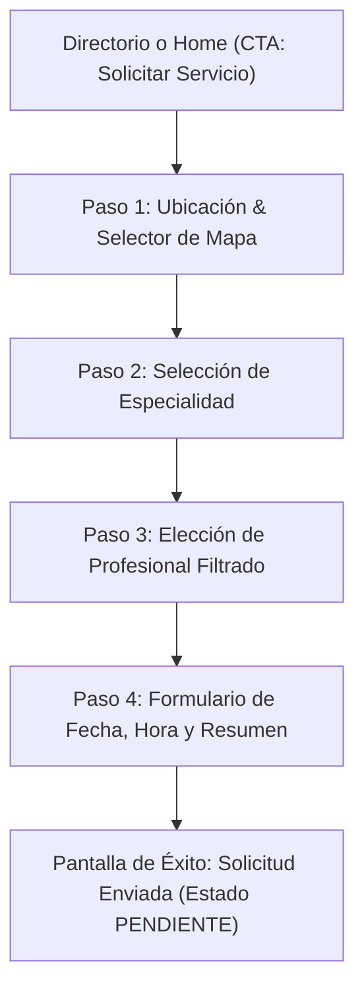
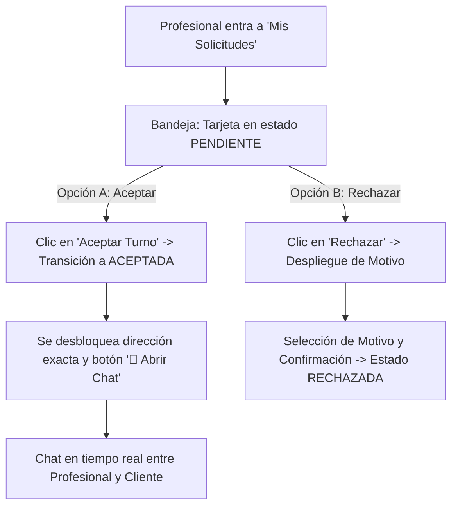

# Especificación Técnica de UI/UX y Workflows para Prototipado (Figma / AI)
**Proyecto:** Vincula-UP — Red Técnica con Respaldo Universitario (Universidad Popular de Concepción del Uruguay)  
**Alcance:** MVP (Minimum Viable Product)  
**Formato de salida esperado:** Frames interactivos en Figma / prototipo visual responsivo (Desktop 1440px y Mobile 390px).

---

## 1. Contexto y Objetivos del Prototipo

### 1.1. Propósito
Vincula-UP conecta a la comunidad con profesionales de oficios técnicos validados (electricidad, plomería, gas, refrigeración, etc.), con respaldo institucional de la Universidad Popular. Permite resolver servicios técnicos de proximidad mediante un flujo transparente de solicitud, coordinación y calificación.

### 1.2. Roles del MVP
1. **Cliente / Vecino:** Busca oficios, define su ubicación geográfica (dirección o mapa), solicita turno, chatea para coordinar y califica el servicio finalizado.
2. **Profesional Técnico:** Completa su activación (foto, radio de cobertura, horarios semanales), gestiona solicitudes (acepta/rechaza con motivo), coordina por chat con el cliente.
3. **Administrador Institucional:** Da de alta profesionales al padrón con número de legajo y especialidades asignadas, monitorea el estado (Cargado, Activo, Suspendido) y puede suspender o reactivar cuentas.

---

## 2. Sistema de Diseño (Design System & Tokens)

El estilo visual debe transmitir **calidez, seriedad universitaria y claridad técnica editorial**. No debe verse como una app genérica corporativa azul ni como una red social saturada.

### 2.1. Paleta de Colores (Tokens HEX)

| Token | HEX | Rol en la Interfaz |
| :--- | :--- | :--- |
| `--paper` (Fondo General) | `#F6F3EC` | Fondo global de la aplicación (tono cálido papel pergamino) |
| `--surface-card` | `#FFFDF8` / `#FFFFFF` | Fondo de tarjetas principales, paneles y modales |
| `--ink` (Texto Principal) | `#1E2926` | Títulos, textos primarios, bordes fuertes, botones de acción primaria |
| `--muted` (Texto Secundario) | `#67716C` | Subtítulos, metadatos, etiquetas de apoyo, placeholders |
| `--line` (Bordes & Divisores) | `#D8D8CE` | Líneas divisorias, bordes de cards y campos de formulario |
| `--coral` (Acento & Alerta) | `#E35F43` | Badges de atención, motivo de rechazo, acciones destructivas, brand mark |
| `--emerald` (Éxito & Activo) | `#448064` | Badge "Activo", confirmaciones, botón de completar |
| `--amber` (Pendiente) | `#A56C19` | Badge "Pendiente de respuesta", avisos de espera |
| `--navy` (Chat & Info) | `#1E4B7A` | Burbujas de mensaje propio, botón de abrir chat, enlaces informativos |
| `--surface-highlight` | `#F3F5F1` | Fondo de tags, selección de chips, burbujas de mensaje entrante |

### 2.2. Tipografía

| Nivel | Tipografía | Peso | Tamaño (Desktop) | Tamaño (Mobile) | Interlineado |
| :--- | :--- | :--- | :--- | :--- | :--- |
| **Eyebrow / Badge** | Sans-Serif (Trebuchet MS / Inter) | 800 (Bold) | 12px (0.75rem) | 11px | 1.2 / Uppercase, letter-spacing: +0.12em |
| **H1 Hero / Título Principal** | Serif (Georgia / Newsreader) | 400 (Regular) | 48px – 64px | 34px | 1.0 – 1.05 |
| **H2 Sección / Nombre Card** | Serif (Georgia) | 400 (Regular) | 26px – 32px | 22px | 1.15 |
| **H3 / H4 Subsecciones** | Sans-Serif (Trebuchet MS / Inter) | 700 (Bold) | 16px – 18px | 15px | 1.3 |
| **Cuerpo / Párrafos** | Sans-Serif (Trebuchet MS / Inter) | 400 (Regular) | 15px – 16px | 14px | 1.6 |
| **Meta / Labels / Hints** | Sans-Serif (Trebuchet MS / Inter) | 500 / 600 | 12px – 13px | 12px | 1.4 |

### 2.3. Radios de Borde y Sombras
- **Radios:**
  - Botones y inputs: `8px` (`0.5rem`) a `10px` (`0.6rem`)
  - Tarjetas y paneles: `16px` (`1rem`)
  - Chips y Badges: `999px` (Pill totalmente redondeado)
- **Sombras:**
  - Muy sutiles y orgánicas: `box-shadow: 0 2px 8px rgba(30, 41, 38, 0.04);`
  - Modales: `box-shadow: 0 16px 40px rgba(30, 41, 38, 0.14);`

---

## 3. Arquitectura de Navegación y Shell Global

### 3.1. Barra de Navegación Superior (`Site Header`)
- **Logo:** Cuadrado o círculo con fondo Coral (`#E35F43`) y letra blanca "V", seguido de texto serif **"Vincula-UP"** (subíndice discreto "-UP" en Coral).
- **Enlaces de Navegación Central:**
  - `Directorio` (público / para todos)
  - `Cómo funciona` (público)
  - `Mis solicitudes` (visible solo para roles `CLIENTE` y `PROFESIONAL`)
  - `Activar perfil` (visible solo para rol `PROFESIONAL`)
  - `Administración` (visible solo para rol `ADMIN`)
- **Extremo Derecho (Estado de Sesión):**
  - **Usuario Anónimo:** Botón de texto *"Ingresar"* (enlace a login Keycloak).
  - **Usuario Autenticado:** Pill con nombre del usuario (ej: *"Sofia Gomez"* o *"Luciano Benitez"*), badge de rol en gris claro y botón secundario *"Salir"* (Logout).

### 3.2. Pie de Página (`Site Footer`)
- Fondo de color papel con borde superior de 1px (`--line`).
- Texto: *"Una red técnica con respaldo universitario · Vincula-UP — Universidad Popular de Concepción del Uruguay"*.

---

## 4. Pantallas de Acceso y Exploración

### PANTALLA 1: Inicio / Landing Page (`/`)
**Objetivo:** Transmitir legitimidad institucional, explicar el valor de la proximidad técnica y motivar al usuario a solicitar un turno o ingresar.

#### Componentes del Layout:
1. **Hero Section (Grid 2 columnas):**
   - **Columna Izquierda:**
     - Eyebrow: `UNIVERSIDAD POPULAR DE CONCEPCIÓN DEL URUGUAY` en color coral.
     - H1: *"Una red técnica con respaldo universitario."*
     - Bajada: *"Vincula-UP conecta a la comunidad con profesionales técnicos validados, cerca de tu zona y con disponibilidad clara."*
     - Lista de pilares (con viñetas cuadradas):
       - **Servicios cercanos:** Profesionales en tu zona con disponibilidad visible.
       - **Solicitudes claras:** Elegís horario y seguís tu pedido desde un solo lugar.
       - **Respaldo institucional:** Una red validada por la Universidad Popular.
     - Botones de acción:
       - Primario: *"Buscar un profesional →"* (`#1E2926` fondo, texto blanco).
       - Secundario: *"Cómo funciona"* (outline con borde `--line`).
   - **Columna Derecha (Ficha Editorial "01 / Servicio técnico comunitario"):**
     - Card con fondo `#FFFDF8`, borde `--line` y número grande serif `01`.
     - Párrafo descriptivo y tags de actores: `[V] Vecinos`, `[P] Profesionales`, `[U] Universidad`.
2. **Sección de Confianza:**
   - 3 bloques horizontales con estadísticas o garantías institucionales:
     - *"Legajos auditados"*
     - *"Zonas delimitadas por GPS"*
     - *"Coordinación directa sin intermediarios comerciales"*

---

### PANTALLA 2: Acceso / Iniciar Sesión (`/ingresar`)
**Objetivo:** Permitir el ingreso mediante Keycloak OIDC sin fricciones y facilitar pruebas con cuentas demo.

#### Componentes del Layout:
1. **Contenedor Central Centrado (Max-width 480px):**
   - Card limpia con padding amplio (32px).
   - Eyebrow: `ACCESO VINCULA-UP`.
   - H1: *"Entrá a tu espacio de la red."*
   - Subtítulo: *"Iniciá sesión con Keycloak para acceder a la plataforma."*
2. **Botón Principal de Login OIDC:**
   - Botón ancho con diseño destacado:
     - Título: **"Iniciar sesión con Keycloak"**
     - Subtexto: *"Acceso seguro mediante OpenID Connect"*
     - Icono de candado / shield universitario.
3. **Caja de Credenciales Demo (Hint institucional):**
   - Panel inferior con fondo `#F8F6F0` y borde dashed:
     - Título: *"Usuarios de prueba disponibles en el realm:"*
     - 3 filas con badges de rol:
       - `[CLIENTE]` `cliente@vincula-up.local` · clave `password` (Sofia Gomez)
       - `[PROFESIONAL]` `profesional@vincula-up.local` · clave `password` (Luciano Benitez)
       - `[ADMIN]` `admin@vincula-up.local` · clave `password` (Admin Vincula-UP)

---

### PANTALLA 3: Directorio de Profesionales (`/directorio`)
**Objetivo:** Explorar los técnicos disponibles, ver su especialidad, reputación, cobertura territorial y solicitar turno.

#### Componentes del Layout:
1. **Header de Página:**
   - H1: *"Directorio de Profesionales Técnicos"*
   - Bajada: *"Encontrá técnicos matriculados y validados por la Universidad Popular en tu zona."*
2. **Barra de Herramientas & Filtros:**
   - **Input de Búsqueda:** Campo con icono de lupa, placeholder *"Buscar por oficio, legajo, nombre o zona..."*.
   - **Tabs de Filtro por Estado (solo visible si es Admin):** Chips `Todos`, `Activos`, `Pendientes`, `Suspendidos`.
   - **Contador:** *"X profesionales encontrados"*.
3. **Grilla de Profesionales (Cards en 3 columnas Desktop / 1 columna Mobile):**
   - **Anatomía de la Card de Profesional:**
     - **Topline:** Avatar con foto real o círculo de iniciales estilizado (`LB`, `MA`) + Badge de estado (`ACTIVO` en verde, `CARGADO` en ámbar, `SUSPENDIDO` en coral) + Sello *"Validado ✓"*.
     - **Nombre:** H2 serif *"Luciano Benitez"*.
     - **Legajo:** Badge gris *"Legajo: P-2001"*.
     - **Especialidad:** Texto en negrita *"Electricidad domiciliaria"*.
     - **Ubicación & Cobertura:** *"Concepción del Uruguay · Radio 25 km"*.
     - **Reputación:** Estrellas doradas `★ 4.9 (28 reseñas)`.
     - **Disponibilidad:** Indicador en verde *"Disponible esta semana"*.
     - **Botonera inferior:**
       - Si el usuario es **Cliente**: Botón primario *"Solicitar servicio →"*.
       - Si el usuario es **Admin**: Botón de *"Suspender"* o *"Reactivar"*.

---

## 5. FLUJO DETALLADO 1: CREACIÓN DE SOLICITUD DE TURNO (Rol: Cliente)
**Objetivo para la IA:** Renderizar cada uno de los 4 pasos y el modal de mapa interactivo con todos sus estados y microinteracciones.

### Frame 4.1 — Paso 1: Ubicación Geográfica del Servicio
- **Nombre de Frame en Figma:** `Cliente / Solicitud - 01 Ubicacion`
- **Encabezado:**
  - Stepper visual de 4 pasos: `[1 Ubicación (Activo)]` — `[2 Especialidad]` — `[3 Profesional]` — `[4 Confirmación]`.
  - Eyebrow: `NUEVA SOLICITUD`.
  - H1: *"¿Dónde necesitás el servicio?"*
  - Bajada: *"Definí tu ubicación para calcular distancias reales con los profesionales y coordinar la visita técnica."*
- **Componente Buscador de Dirección:**
  - Input grande con icono de lupa: `[ 🔎 Calle, altura, ciudad o barrio (ej: San Martín 123)... ]`.
  - Desplegable de autocompletado en tiempo real con sugerencias de calles locales y barrios.
- **Acciones Rápidas:**
  - Botón destacado con icono: `[ 🎯 Usar mi ubicación GPS actual ]` (con estado de carga *"Detectando..."*).
  - Fila de Chips de ubicaciones sugeridas:
    - `[📍 Plaza Ramírez]`
    - `[📍 Universidad Popular]`
    - `[📍 Zona Puerto]`
    - `[📍 Barrio Centro]`
- **Card de Ubicación Confirmada (Aparece al seleccionar):**
  - Borde verde suave, icono de checkmark `✅`.
  - Dirección legible: **San Martín 450, Concepción del Uruguay**.
  - Coordenadas GPS: `Lat: -32.4845, Lng: -58.2321`.
  - Botón secundario: `[ 🗺️ Ajustar en mapa interactivo ]`.
- **Botón de Avance:** `[ Continuar con esta ubicación → ]` (Fondo `#1E2926`, texto blanco, disabled hasta confirmar ubicación).

---

### Frame 4.1-Modal — Modal Interactivo de Mapa (OpenStreetMap / Pin Drop)
- **Nombre de Frame en Figma:** `Cliente / Modal - Ajustar Ubicacion Mapa`
- **Comportamiento:** Overlay oscuro (`rgba(0,0,0,0.5)`) con backdrop blur.
- **Caja Modal (Centrada, 720px ancho):**
  - **Header:** Título *"Elegí tu ubicación en el mapa"* + botón de cerrar `[ ✕ ]`.
  - **Buscador integrado:** Campo para tipear calle con botón `[ Buscar ]`.
  - **Área de Mapa (350px alto):** Render de mapa cartográfico con marcador arrastrable rojo/coral (`📍`).
  - **Barra de Coordenadas:** *"Latitud: -32.4845 · Longitud: -58.2321"*.
  - **Footer:** Botón `[ Cancelar ]` y botón primario `[ Confirmar esta posición en el mapa ]`.

---

### Frame 4.2 — Paso 2: Selección de Categoría / Especialidad
- **Nombre de Frame en Figma:** `Cliente / Solicitud - 02 Especialidad`
- **Encabezado:**
  - Botón de retroceso: `[ ← Volver a ubicación ]`.
  - Stepper: `[1 ✓]` — `[2 Especialidad (Activo)]` — `[3 Profesional]` — `[4 Confirmación]`.
  - H1: *"¿Qué oficio o servicio necesitás?"*
  - Bajada: *"Seleccioná la categoría técnica que se ajuste a tu necesidad."*
- **Grid de Categorías (Cards interactivas con hover y estado seleccionado):**
  1. ⚡ **Electricidad domiciliaria:** Instalaciones, térmicas, disyuntores, cortocircuitos.
  2. 🔧 **Plomería y gas:** Cañerías, sanitarios, calefones, pérdidas y grifería.
  3. ❄️ **Refrigeración y aire:** Instalación y carga de gas en splits, heladeras familiares.
  4. 🧺 **Reparación de electrodomésticos:** Lavarropas, secarropas, microondas, hornos.
  5. 🚪 **Cerrajería integral:** Aperturas de urgencia, cambio de combinación, cerraduras.
  6. 🎨 **Pintura y albañilería:** Arreglos de mampostería, pintura interior y exterior.
- **Microinteracción:** Al hacer clic en una tarjeta, se resalta con borde de 2px color Coral (`#E35F43`) y avanza automáticamente al paso 3.

---

### Frame 4.3 — Paso 3: Elección de Profesional Filtrado
- **Nombre de Frame en Figma:** `Cliente / Solicitud - 03 Seleccion Profesional`
- **Encabezado:**
  - Botón `[ ← Volver a categorías ]`.
  - Stepper: `[1 ✓]` — `[2 ✓]` — `[3 Profesional (Activo)]` — `[4 Confirmación]`.
  - Eyebrow: `ELECTRICIDAD DOMICILIARIA`.
  - H1: *"Profesionales disponibles cerca de tu zona"*
  - Subtítulo: *"Ordenados por distancia a tu domicilio y reputación universitaria."*
- **Lista de Tarjetas de Técnicos (Cards con layout horizontal):**
  - **Tarjeta 1 (Recomendado):**
    - Foto de perfil con borde circular + Sello verde *"Validado UP ✓"*.
    - Nombre: **Luciano Benitez** · Badge: `Legajo P-2001`.
    - Reputación: `★ 4.9 (28 calificaciones)`.
    - **Distancia calculada:** Badge verde *"📍 A 2.1 km de tu ubicación · Dentro de zona"*.
    - Disponibilidad: *"Atiende de Lunes a Sábados de 08:00 a 20:00 hs"*.
    - Botón primario: `[ Solicitar turno con Luciano → ]`.
  - **Tarjeta 2:**
    - Iniciales `MA` (Mariana Acosta) · `Legajo P-2002` · `★ 4.8 (19 calificaciones)`.
    - Distancia: *"📍 A 4.5 km · Dentro de zona"*.
    - Botón primario: `[ Solicitar turno con Mariana → ]`.

---

### Frame 4.4 — Paso 4: Formulario de Fecha, Horario y Confirmación
- **Nombre de Frame en Figma:** `Cliente / Solicitud - 04 Formulario Visita`
- **Encabezado:**
  - Botón `[ ← Cambiar profesional ]`.
  - Stepper: `[1 ✓]` — `[2 ✓]` — `[3 ✓]` — `[4 Confirmación (Activo)]`.
  - H1: *"Coordiná tu visita técnica con Luciano Benitez"*
  - Subtítulo: *"Electricidad domiciliaria · Legajo P-2001"*.
- **Contenido del Formulario:**
  - **Selector de Fecha:** Campo fecha con calendario `[ Seleccionar día (ej: 15/10/2026) ]`.
  - **Selector de Horario:** Campo con reloj `[ Horario aproximado (ej: 10:00 hs) ]`.
  - **Resumen Bloqueado de Ubicación:**
    - Caja con fondo `#F8F6F0` y candado: *"📍 San Martín 450, Concepción del Uruguay"*.
    - Coordenadas validadas: `Lat -32.4845, Lng -58.2321`.
  - **Mensaje Institucional de Privacidad:**
    - Fondo crema con borde lateral Coral:
    - *"🛡️ Tu dirección exacta y datos de contacto solo se comparten con el profesional una vez que este acepte la solicitud."*
- **Botón de Envío:** `[ Enviar solicitud de turno → ]` (Fondo `#1E2926`, ancho completo).

---

### Frame 4.5 — Pantalla de Éxito Inmediata (Post-Envío)
- **Nombre de Frame en Figma:** `Cliente / Solicitud - 05 Confirmacion Exitosa`
- **Layout:** Tarjeta central destacada con fondo blanco sobre `#F6F3EC`.
- **Elementos:**
  - Círculo verde con check gigante: `[ ✓ ]` (64px, fondo `#EAF5EB`, icono `#225339`).
  - Eyebrow: `SOLICITUD REGISTRADA`.
  - H1: *"¡Tu pedido fue enviado con éxito!"*
  - Mensaje: *"Luciano Benitez fue notificado de tu turno para el **15 de Octubre a las 10:00 hs**. El estado actual es **PENDIENTE DE RESPUESTA**."*
  - Próximos pasos explicados:
    1. El técnico revisa su agenda y la zona de cobertura.
    2. Recibirás la confirmación inmediata en tu panel.
    3. Se habilitará el chat directo para ultimar detalles.
  - Botón de Acción Principal: `[ Ir a Mis Solicitudes para hacer seguimiento → ]`.

---

## 6. FLUJO DETALLADO 2: RECEPCIÓN, REVISIÓN Y ACEPTACIÓN (Rol: Profesional)
**Objetivo para la IA:** Diseñar la experiencia del profesional desde que recibe el pedido hasta que lo acepta, abre el canal de chat o lo rechaza con motivo justificado.

### Frame 5.1 — Bandeja de Entrada del Profesional (`/mis-solicitudes`)
- **Nombre de Frame en Figma:** `Profesional / Solicitudes - 01 Pendiente Entrante`
- **Navbar del Profesional:**
  - Muestra enlaces: `Directorio` | `Mis solicitudes (1)` | `Activar perfil`.
  - Usuario: `Luciano Benitez` · Badge `PROFESIONAL` · Botón `Salir`.
- **Filtros de Pestañas:** `[ Todas (4) ]` — `[ Pendientes (1) - Activa ]` — `[ Aceptadas (2) ]` — `[ Historial (1) ]`.
- **Tarjeta de Solicitud Pendiente (Card destacada):**
  - **Topline:**
    - Badge animado/destacado: `● PENDIENTE DE RESPUESTA` (Fondo `#FEF5E7`, texto `#A56C19`, borde fino).
    - Timestamp: *"Recibido hace 15 minutos"*.
  - **Cuerpo del Pedido:**
    - Título del Oficio: H2 *"Electricidad domiciliaria"*.
    - Datos del Cliente: *"Solicitado por: Sofia Gomez"*.
    - Fecha y Hora solicitada: `📅 15 de Octubre · 10:00 hs`.
    - Ubicación del servicio: `📍 Barrio Centro, Concepción del Uruguay` (con badge *"A 2.1 km de tu base operativa"*).
    - Mensaje de solicitud del cliente: *"Hola Luciano, necesito revisar un cortocircuito en el tablero principal que hace saltar la térmica."*
  - **Botonera de Decisión Inmediata:**
    - Botón Primario Verde: **`[ ✓ Aceptar turno ]`** (Fondo `#448064`, texto blanco).
    - Botón Secundario Outline: **`[ ✕ Rechazar ]`** (Borde coral `#E35F43`, texto `#E35F43`).

---

### Frame 5.2 — Acción de Rechazo con Motivo (Camino Alternativo)
- **Nombre de Frame en Figma:** `Profesional / Solicitudes - 02 Modal Rechazo`
- **Comportamiento:** Al presionar `[ ✕ Rechazar ]`, la tarjeta expande un cuadro de advertencia inline o modal:
  - Título: *"Indicar motivo del rechazo"*
  - Subtexto: *"El motivo será informado a Sofia Gomez para que pueda buscar otro profesional en la red."*
  - **Chips de Motivos Frecuentes (Clickeables):**
    - `[ Horario superpuesto ]`
    - `[ Fuera de radio de atención ]`
    - `[ Falta de repuestos específicos ]`
  - **Campo de texto libre:** Input con placeholder *"Escribí un motivo aclaratorio (opcional)..."*.
  - **Botones:**
    - Botón Destructivo: `[ Confirmar Rechazo ]` (Fondo coral `#E35F43`, texto blanco).
    - Botón Texto: `[ Cancelar y mantener solicitud ]`.
- **Resultado visual del rechazo:**
  - El badge pasa a `RECHAZADA` (Fondo rosa `#FBEBEE`, texto `#C24132`).
  - Caja informativa: *"Motivo registrado: Fuera de radio de atención para urgencias"*.
  - Los botones de acción desaparecen.

---

### Frame 5.3 — Confirmación y Aceptación del Turno
- **Nombre de Frame en Figma:** `Profesional / Solicitudes - 03 Turno Aceptado`
- **Microinteracción:** Al hacer clic en `[ ✓ Aceptar turno ]`:
  - Toast de notificación superior verde: *"✓ ¡Turno confirmado con Sofia Gomez! La dirección exacta ya está disponible."*.
  - La tarjeta actualiza sus datos en tiempo real:
    - Badge cambia a: `ACEPTADA` (Fondo verde `#EAF5EB`, texto `#225339`).
    - Subtítulo de estado: *"Coordinación activa · Usá el chat para acordar detalles"*.
    - **Dirección desbloqueada completa:** `📍 San Martín 450, Timbre 2B, Concepción del Uruguay`.
- **Nuevas Acciones Disponibles:**
  - Botón principal de Mensajería: **`[ 💬 Abrir Chat con Sofia ]`** (Fondo `#EEF3F9`, texto `#1E4B7A`, borde `#D3E0EA`).

---

### Frame 5.4 — Vista del Chat de Coordinación en Vivo
- **Nombre de Frame en Figma:** `Comun / Solicitudes - 04 Chat Abierto`
- **Comportamiento:** Al pulsar `[ 💬 Abrir Chat ]`, se despliega una consola de mensajería dentro de la misma tarjeta:
  - **Barra de Chat:**
    - Titular: *"Chat directo de coordinación"* · *"Canal seguro entre Luciano Benitez y Sofia Gomez"*.
    - Botón: `[ Ocultar chat ]`.
  - **Ventana de Conversación (Burbujas de Mensajes):**
    - **Mensaje 1 (Sofia - Cliente):**
      - Alineado a la izquierda, fondo `#F3F5F1`, texto `#1E2926`.
      - Etiqueta: *"Sofia Gomez · 10:05 hs"*.
      - Texto: *"Hola Luciano, ¿necesitás que compre algún disyuntor antes de que vengas?"*
    - **Mensaje 2 (Luciano - Profesional):**
      - Alineado a la derecha, fondo `#EEF3F9`, texto `#1E2926`.
      - Etiqueta: *"Vos · 10:08 hs"*.
      - Texto: *"Hola Sofía! No te preocupes, llevo el instrumental para medir la descarga a tierra primero y ahí vemos si hace falta cambiarlo."*
  - **Caja de Entrada:**
    - Input de texto: `[ Escribí un mensaje... ]` + Botón `[ Enviar ]` (`#1E2926`).

---

### Frame 5.5 — Vista Simultánea en el Panel del Cliente (Pantalla en Espejo)
- **Nombre de Frame en Figma:** `Cliente / Solicitudes - Estado Aceptada`
- **Qué ve Sofia en su pantalla de `/mis-solicitudes` al ser aceptada:**
  - Badge de la tarjeta pasa a: `ACEPTADA` en verde.
  - Aviso: *"Luciano Benitez confirmó tu visita técnica para el 15/10 a las 10:00 hs."*.
  - Botones disponibles para el cliente:
    - **`[ 💬 Abrir Chat ]`** (mismo chat interactivo compartido).
    - **`[ ✓ Marcar servicio como completado ]`** (se habilita para cuando concluya el trabajo).

---

### Frame 5.6 — Finalización del Servicio y Calificación con Estrellas
- **Nombre de Frame en Figma:** `Cliente / Solicitudes - Finalizar y Calificar`
- **Flujo:**
  1. Concluida la visita técnica, Sofia pulsa `[ ✓ Marcar servicio como completado ]`.
  2. El badge cambia a `COMPLETADA` (Azul `#EEF3F9`).
  3. Se despliega el **Widget Interactivo de Calificación**:
     - H4: *"¿Cómo fue la atención de Luciano Benitez?"*
     - **Selector de Estrellas:** 5 estrellas doradas interactivas `[ ★ ★ ★ ★ ★ ]`. Al pasar el mouse se iluminan en `#F59E0B`.
     - Leyenda: *"5 de 5 estrellas — Excelente servicio"*.
     - Campo de texto: `[ Dejá un comentario sobre la atención recibida (opcional)... ]`.
     - Botón: `[ Enviar calificación al profesional ]`.
  4. **Estado Calificado Permanente:**
     - Muestra las estrellas fijas: `★ ★ ★ ★ ★ (5/5)`.
     - Cita de la reseña: *"Puntualidad impecable, detectó la falla en 15 minutos y dejó todo funcionando."*.

---

## 7. Pantallas de Gestión Profesional y Administración

### PANTALLA 6: Activación de Perfil Profesional (`/activar-perfil`)
**Objetivo:** Wizard de incorporación rápida para que el técnico cargue sus parámetros operativos.

#### Indicador de Pasos (Stepper):
- 3 círculos numerados: `[1 Foto]` — `[2 Zona y GPS]` — `[3 Disponibilidad]`. Círculo activo con fondo oscuro `#1E2926`.

#### Contenido por Paso:
- **Paso 1: Imagen Profesional:**
  - Título: *"Tu imagen profesional"*.
  - Subtexto: *"Una foto clara ayuda a que los clientes reconozcan tu perfil en la comunidad."*.
  - Cuadro drag & drop con selector de archivo e icono de cámara.
- **Paso 2: Zona de Cobertura y GPS:**
  - Título: *"Tu zona de cobertura"*.
  - Campo: *"Localidad o zona base"* (ej: *"Concepción del Uruguay"*).
  - Slider interactivo de Radio: `Radio de cobertura: [ 25 ] km` (rango de 1 a 50 km).
  - Feedback visual de geolocalización resuelta por backend.
- **Paso 3: Disponibilidad Horaria Semanal:**
  - Título: *"Tu disponibilidad semanal"*.
  - Selector de día: Dropdown con `Lunes`, `Martes`, `Miércoles`, `Jueves`, `Viernes`, `Sábado`.
  - Fila de horarios: `Desde [ 08:00 ]` hasta `Hasta [ 18:00 ]`.
  - Botón final: *"Activar mi perfil →"*.
- **Estado de Éxito:**
  - Título: *"Ya estás dentro de la red."*
  - Explicación: *"Tu perfil quedó preparado para aparecer en el directorio cuando se confirme la activación."*

---

### PANTALLA 7: Panel de Administración Institucional (`/admin`)
**Objetivo:** Monitoreo institucional de legajos técnicos, altas y control disciplinario.

#### Componentes del Layout:
1. **Encabezado Institucional:**
   - Eyebrow: `PANEL INSTITUCIONAL`.
   - H1: *"Seguimiento de profesionales"*.
   - Bajada: *"Revisá quiénes completaron su perfil y gestioná el padrón oficial de la Universidad Popular."*
2. **Formulario de Alta Individual (Card compacta):**
   - Título: *"Alta individual de profesional"*.
   - **Selector de Usuario:** Menú desplegable con los usuarios registrados en Keycloak con rol `PROFESIONAL` (ej: *"Luciano Benitez (profesional@vincula-up.local)"*).
   - **Campo Legajo:** Input para código universitario (ej: *"P-2040"*).
   - **Checkboxes de Especialidades (Chips seleccionables):**
     - `[x] Electricidad domiciliaria`
     - `[ ] Plomería y gas`
     - `[ ] Refrigeración`
     - `[ ] Reparación de electrodomésticos`
   - Botón: *"Guardar profesional"*.
3. **Tabla General del Padrón:**
   - Columnas: `Legajo` | `Profesional / Email` | `Especialidades` | `Estado` | `Acciones`.
   - Filas de ejemplo:
     - `P-2001` | Luciano Benitez | Electricidad | Badge `ACTIVO` (verde) | Botón outline *"Suspender"*.
     - `P-2002` | Mariana Acosta | Plomería | Badge `SUSPENDIDO` (coral) | Botón verde *"Reactivar"*.
     - `P-2003` | Jorge Sosa | Refrigeración | Badge `CARGADO` (ámbar) | Texto *"Pendiente activación"*.

---

## 8. Directivas de Generación para Herramientas de IA / Figma

Cuando una IA procese este documento para crear el prototipo visual, debe aplicar las siguientes reglas:

1. **Auto Layout en todo:** Todos los botones, cards, listas y modales deben utilizar Auto Layout (vertical u horizontal) con `gap` consistente (8px, 12px, 16px, 24px).
2. **Contraste Accesible:** Mantener siempre el texto principal `--ink` (`#1E2926`) sobre los fondos `--paper` (`#F6F3EC`) y `--surface-card` (`#FFFFFF`).
3. **Componentes con Variantes:**
   - `Button`: Variantes `Primary` (negro/ink), `Secondary` (outline), `Danger` (coral), `Success` (esmeralda), `Chat` (navy).
   - `Status Badge`: Variantes `Pendiente`, `Aceptada`, `Rechazada`, `Completada`, `Cancelada`, `Suspendido`.
   - `Request Card`: Estados expandido con chat, colapsado, con modal de rechazo, con widget de estrellas.
4. **Flujos de Conexión Prototipo (Wires):**
   - Click en *"Buscar un profesional"* en Home → Navega a `Directorio`.
   - Click en *"Solicitar servicio"* en Directorio → Navega al flujo `Solicitar (Paso 1)`.
   - Completar Formulario en Solicitar → Navega a `Mis Solicitudes`.
   - Click en *"Aceptar turno"* (como profesional) → Transiciona la tarjeta a estado `Aceptada` y habilita el botón de Chat.
   - Click en *"Marcar completado"* (como cliente) → Transiciona la tarjeta a estado `Completada` y despliega el formulario de estrellas.
